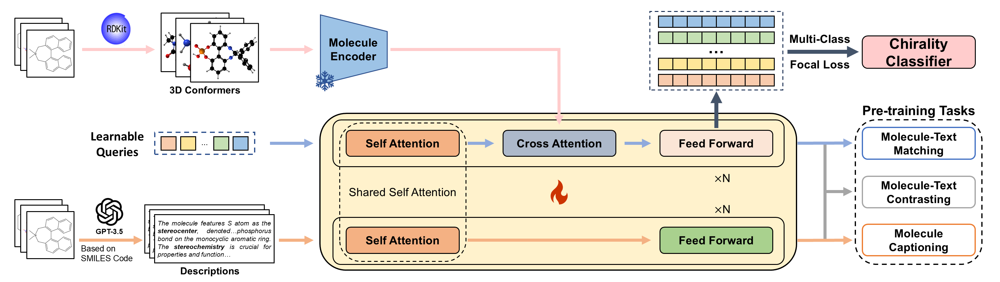

# ChiralCat: Molecular Chirality Classification with Enhanced Spatial Representation Using Learnable Queries

##  Framework



- ChiralCat’s core is a pretrained multi-modal classifier that enhances spatial molecular representations.

- ChiralCat consists of two major components: 1) a frozen 3D-molecular encoder that provides embeddings for molecules;
  and 2) a molecule-text integrator that combines these molecular embeddings with natural language descriptions. 


##  Requirements

See ``requirements.txt`` for detailed requirements.

## Pretrain

To execute the pretraining tasks for ChiralCat, you can run the following command:

```shell
bash cd ChiralCat-Pretrain
bash ./pretrain.sh
```

##  Finetune

After pretraining, you need to select the appropriate pretrained weights and rename the checkpoint file to ``pretrain.ckpt``. Place this file in the ``ChiralCat-Classifier`` directory. Then, you can run the following command:

```shell
bash cd ChiralCat-Classifier 
bash ./finetune.sh
```

After obtaining the best model, rename the corresponding checkpoint file to ``best.ckpt``  and place it in the ``ChiralCat-Classifier`` directory. You can then test the model by running the following command.

```shell
bash ./test.sh
```

##  Dataset & CheckPoint

Our dataset and checkpoint files will be made publicly available after our paper is accepted. After downloading the dataset, you need to place the train dataset, valid dataset and test dataset in the appropriate folders within the ``./data/`` directory.

- data
  - train
  - valid
  - test

After downloading the checkpoint files, you need to  place them in the appropriate folders within the ``./all_checkpoints/`` directory.

- all_checkpoints
  - Uni-mol
  - SciBERT

All our checkpoint files can be found in https://figshare.com/articles/dataset/ChiralCat_s_weights/28091852
